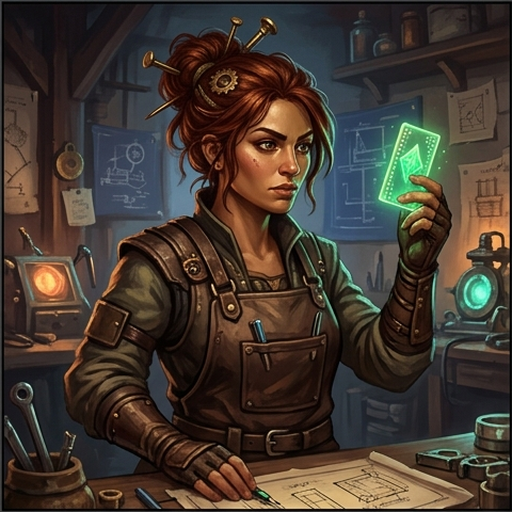
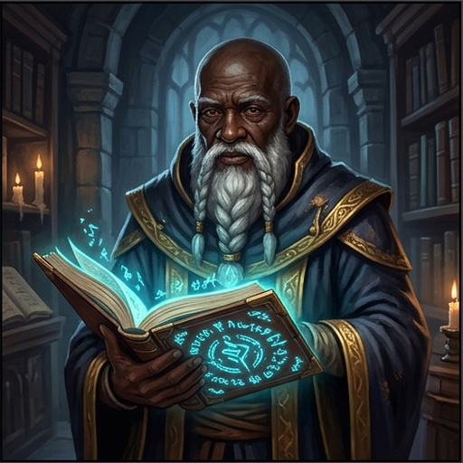
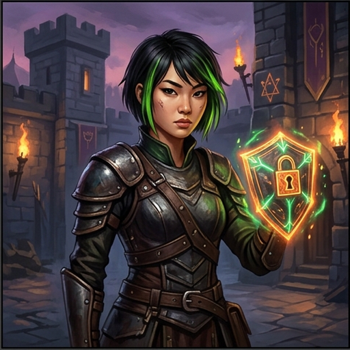
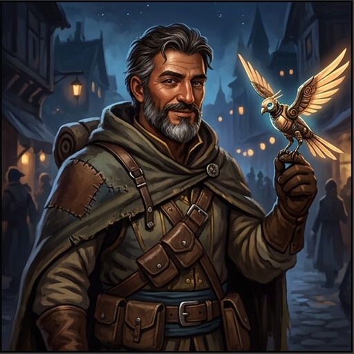
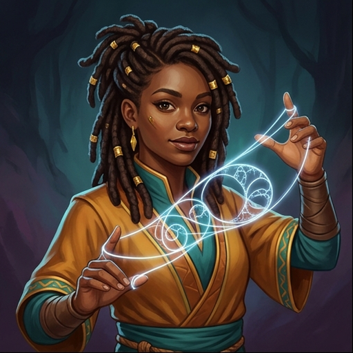
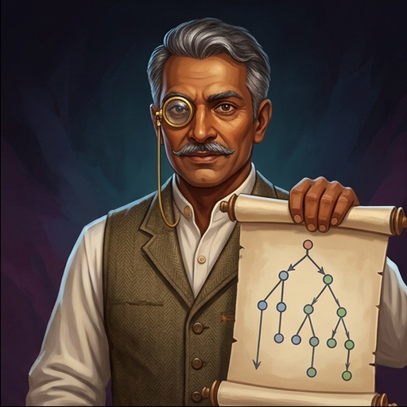
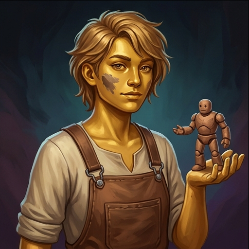
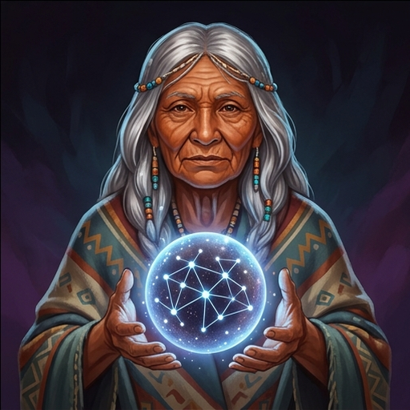

# NPC Mentors of the Recursive Dragon

A guide to the non-player characters (NPCs) who teach core computing and computer science concepts throughout the labyrinth of *Loop of the Recursive Dragon*.

---

## Gallery Overview

| Portrait | Name | Domain & Concepts | Tone / Archetype |
| :---: | :--- | :--- | :--- |
|  | **Ada the Chief Artificer**<br>`ada.png` | **Core Computing & Architecture**<br>Von Neumann model, logic gates, binary/hex, clock cycles | Practical, sharp, master builder |
|  | **Master Kaelen the Grand Archivist**<br>`kaelen.png` | **Databases & Relational Models**<br>Schemas, primary/foreign keys, SQL queries, normalization | Venerable, meticulous, structured |
|  | **Valeria "Val" Vex the Ward-Smith**<br>`val.png` | **Cybersecurity & Cryptography**<br>CIA triad, SQL injection, XSS, hashing vs encryption, salting | Edgy, vigilant, security penetration tester |
|  | **Tariq the Beacon-Courier**<br>`tariq.png` | **Networking & Operating Systems**<br>Packets, TCP/IP, DNS, HTTP cycle, cloud architectures | Charismatic, worldly, pathfinder |
|  | **Nia the Logic-Weaver**<br>`nia.png` | **Control Flow & Algorithms**<br>Conditionals, while/for loops, branching, recursion | Playful, poetic, analytical pattern-seeker |
|  | **Prof. Ignatius "Iggy" Flint**<br>`flint.png` | **Software Engineering & Git**<br>SDLC, Agile/sprints, git branch lineages, assertions, testing | Pedantic, rigorous, quality inspector |
|  | **Zoya the Golem-Shaper**<br>`zoya.png` | **Object-Oriented Programming**<br>Classes, objects, inheritance, polymorphism, encapsulation | Hands-on, curious, blueprint artisan |
|  | **Elder Omu the Oracle of Echoes**<br>`omu.png` | **AI, Machine Learning & Ethics**<br>Neural weights, training data, LLM mechanics, bias, accountability | Mystical, wise, ethical philosopher |

---

## Detailed Character Profiles

### 1. Ada the Chief Artificer (`ada.png`)
* **Title:** Chief Artificer of the Guild
* **Demographics:** Woman, late 30s, olive complexion, auburn hair in a brass-pinned bun.
* **Curriculum Focus:** Machine Architecture, Von Neumann Architecture, Logic Gates, Binary/Hex representations, CPU cycles.
* **Personality:** Grounded, encouraging, with zero tolerance for hand-wavy explanations. She believes if you can't trace the switches, you don't really know where the power goes.
* **Sample Line:**
  > *"Every glorious spell in this labyrinth boils down to switches opening and closing in the dark. Let's pry open the panel and trace the clock pulse."*

---

### 2. Master Kaelen the Grand Archivist (`kaelen.png`)
* **Title:** Keeper of the Indexed Vaults
* **Demographics:** Elder man, mid 60s, deep ebony skin, silver-white braided beard and spectacles.
* **Curriculum Focus:** Relational Databases, SQL (`SELECT`, `JOIN`, `GROUP BY`), Primary/Foreign Keys, Constraints, ACID guarantees.
* **Personality:** Dignified and exact. He abhors data anomalies and redundancy. To Kaelen, a broken foreign key is a spiritual offense.
* **Sample Line:**
  > *"A single contradiction in the archives can bring down the entire vault. Write each truth in exactly one place, and let the keys bind them."*

---

### 3. Valeria "Val" Vex the Ward-Smith (`val.png`)
* **Title:** High Inquisitor of Wards & Ciphers
* **Demographics:** Young woman, early 20s, East Asian descent, short undercut hair with phosphor-green streaks.
* **Curriculum Focus:** Cybersecurity, Input Sanitization, SQL Injection, Cross-Site Scripting (XSS), Hashing & Salts, Secrets Management.
* **Personality:** Sharp, irreverent, and always thinking like an attacker. She teaches players how to defend systems by demonstrating how easily naive assumptions are breached.
* **Sample Line:**
  > *"You trusted the adventurer at the door when they said their name was `Robert'); DROP TABLE Students;--`? Come with me. We have much to fix."*

---

### 4. Tariq the Beacon-Courier (`tariq.png`)
* **Title:** Master of the Signal Towers
* **Demographics:** Middle-aged man, 40s, Middle Eastern / Mediterranean descent, tan skin, salt-and-pepper beard.
* **Curriculum Focus:** Networking, OSI & TCP/IP models, Packet Routing, DNS Resolution, HTTP Requests & Status Codes, APIs.
* **Personality:** Energetic, cheerful, and pragmatic. He views the internet as a vast overland caravan of reliable and unreliable couriers.
* **Sample Line:**
  > *"A packet doesn't need to know the whole road—only where the next tower stands. Send it out, number your envelopes, and let the handshake confirm arrival."*

---

### 5. Nia the Logic-Weaver (`nia.png`)
* **Title:** Mistress of the Loom of Flow
* **Demographics:** Young woman, late 20s, Black / African descent, styled locs decorated with gold rings and thread.
* **Curriculum Focus:** Control Flow (`if`/`elif`/`else`), Boolean Logic & Short-Circuiting, While & For Loops, Recursion, Tracing.
* **Personality:** Creative and rhythm-focused. She visualizes code as woven tapestries where single threads split, repeat, or terminate cleanly.
* **Sample Line:**
  > *"Watch how the thread bends at the condition. One false knot and your loop will spin until the stars burn cold. Let us weave a base case first."*

---

### 6. Professor Ignatius "Iggy" Flint (`flint.png`)
* **Title:** Inspector General of Code & Lineage
* **Demographics:** Mature man, 50s, South Asian descent, warm bronze skin, graying hair, mustache, brass monocular.
* **Curriculum Focus:** Software Engineering, Git Lineage & Version Control, Code Reviews, Sprints, Automated Testing & Assertions.
* **Personality:** Fastidious, precise, wielding his red sealing stamp like a blade. He believes unverified code is merely wishful thinking.
* **Sample Line:**
  > *"A commit message of 'fixed stuff' is grounds for expulsion. Document the delta, prove it with an assertion, and merge only when the branch is green."*

---

### 7. Zoya the Golem-Shaper (`zoya.png`)
* **Title:** Blueprint Artisan & Golem Wright
* **Demographics:** Non-binary / androgynous young adult, mid-20s, Central Asian / Slavic descent, golden skin, clay smudge on cheek.
* **Curriculum Focus:** Object-Oriented Programming (OOP), Classes & Instances, Methods & `self`, Inheritance, Polymorphism, Composition.
* **Personality:** Enthusiastic, hands-on maker who treats programming like crafting physical golems from modular clay and clockwork schematics.
* **Sample Line:**
  > *"Don't rebuild the entire golem when you only need a guard golem! Inherit the base frame, override the `patrol()` method, and pass the blueprint along."*

---

### 8. Elder Omu the Oracle of Echoes (`omu.png`)
* **Title:** Custodian of the Recursive Core
* **Demographics:** Venerable elder woman, 70s, Indigenous / First Nations descent, weathered copper skin, long silver hair with beadwork.
* **Curriculum Focus:** Artificial Intelligence, Machine Learning, Perceptrons, Neural Networks, Training Data, Algorithmic Bias, Ethics & Accountability.
* **Personality:** Calm, profound, and vigilant. She demystifies AI by revealing it as mathematical statistical prediction rather than magic or consciousness.
* **Sample Line:**
  > *"The dragon does not think; it remembers. It mirrors every flaw in the mirror we hold before it. Before you trust its prophecies, ask what it was fed."*

---

## Using in Question Sets (`npc_demo`)

The roster the game reads is [`assets/npcs.json`](../../assets/npcs.json) — name, portrait path, pronouns and domain for each mentor above. A scene names its mentor by **`id`** (`ada`, `nia`, `zoya`, `flint`, `kaelen`, `tariq`, `val`, `omu`); the game resolves the display name and portrait from there, so no scene hard-codes an image path.

```json
{
  "type": "npc_demo",
  "npc": "kaelen",
  "question": "NPC: The cardinal rule of keys",
  "intro": "Kaelen pauses by the tall slate ledger and taps a glowing column.",
  "steps": [
    {
      "say": "A primary key must be unique and present for every single row.",
      "beats": [
        { "say": "A primary key must be unique and present for every single row." },
        { "code": "CREATE TABLE users (\n  user_id INTEGER PRIMARY KEY,\n  city TEXT\n);", "language": "sql" },
        { "say": "If two rows could share one key, the archive no longer knows who is who." }
      ],
      "check": {
        "prompt": "Which column would make the most reliable primary key?",
        "answer": "user_id, an integer the database assigns",
        "wrong": ["first_name, since people are usually called different things",
                  "city, because most users live in different places"],
        "why": "user_id is unique and never changes; names and cities are neither."
      }
    }
  ],
  "outro": "Kaelen nods slowly and inks the index entry into the ledger."
}
```

Notes for authors:

- `beats` is how the scene is paced — the screen reveals **one beat per click**. Keep spoken beats to a sentence or two, and always put code in its own `code` beat so it renders as a captioned panel instead of blending into the mentor's speech.
- `check` uses `answer` plus a `wrong` array, not an options list with an index. The game shuffles them.
- Write the prose so it fits the mentor who is teaching. Zoya uses **they/them**; the pronouns for each mentor are in the roster.
- `question` is the scene's title and its identity in the data, so it must be unique within the set. Prefixing with `NPC:` is the convention.
- The full schema, including the rules the automated tests enforce, is in [`question_sets/WRITING_GUIDE.md`](../../question_sets/WRITING_GUIDE.md).
